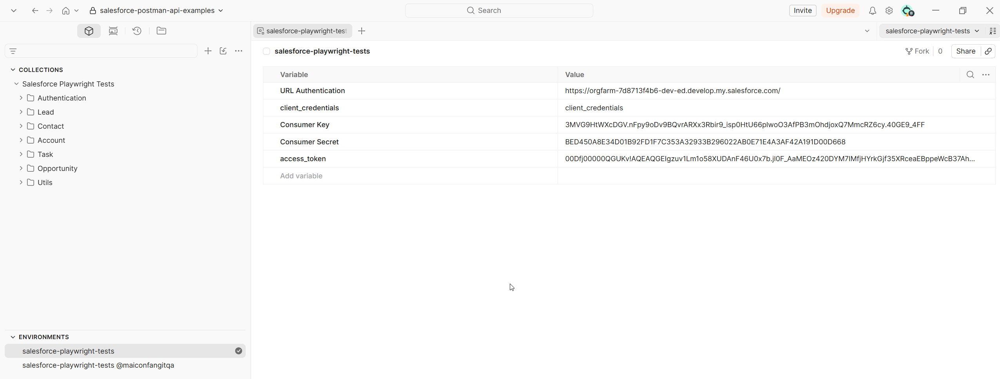
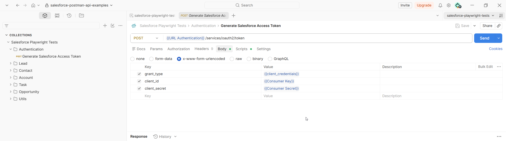

# Salesforce Postman API Examples

This guide demonstrates how to configure Salesforce and Postman to start working with Salesforce REST APIs.

🎥 Video Tutorial:

Salesforce + Postman API Testing | Authentication & Environment Setup (Part 05)

https://www.youtube.com/watch?v=cMHa6x5U7J4

The video walks through the complete setup process, including Salesforce configuration, Connected App creation, Consumer Key and Consumer Secret retrieval, Postman environment setup, access token generation, and basic API requests.

---

## Step 1 - Open External Client App Settings

Navigate to:

```text
Setup → External Client Apps → Settings
```

Enable:

```text
Allow access to External Client App consumer secrets via REST API
```


---

## Step 2 - Create a New Connected App

Navigate to:

```text
Setup → External Client Apps → External Client App Manager
```

Click:

```text
New Connected App
```


---

## Step 3 - Configure Basic Information

Configure the application information.

Example:

* External Client App Name
* Contact Email
* Distribution State
* Info URL
* Description


---

## Step 4 - Configure OAuth Settings

Enable OAuth and configure:

Callback URL:

```text
https://oauth.pstmn.io/v1/callback
```

Recommended OAuth Scopes:

```text
Manage user data via APIs (api)
Full access (full)
```


---

## Step 5 - Retrieve Consumer Key and Consumer Secret

After saving the application, Salesforce generates:

* Consumer Key
* Consumer Secret

These values will be used by Postman to request an access token.

⚠️ Never publish your real Consumer Secret.


---

## Step 6 - Configure the Postman Environment

Create an environment and configure:

```text
URL Authentication
client_credentials
Consumer Key
Consumer Secret
access_token
```

Example:



---

## Step 7 - Generate an Access Token

Create a POST request:

```text
/services/oauth2/token
```

Configure:

```text
grant_type
client_id
client_secret
```

Example:



---

## Step 8 - Save the Access Token Automatically

Use a Postman script to store the generated token.

Example:

```javascript
const response = pm.response.json();

pm.environment.set(
    "access_token",
    response.access_token
);
```


---

## Step 9 - Execute Salesforce Requests

After generating the token, you can call Salesforce APIs.

Example:

```text
GET /services/data/v61.0/sobjects/Lead/{Id}
```

Example:


---

## Available Examples

This repository contains examples for:

* Authentication
* Lead
* Contact
* Account
* Opportunity
* Task

Feel free to explore and adapt them to your own environment.

---

## Disclaimer

This project is intended for learning purposes.

Never commit:

* Passwords
* Consumer Secrets
* Access Tokens
* Refresh Tokens

to a public repository.

---

## Author

Maicon Fang

GitHub:
https://github.com/maiconfang

LinkedIn:
https://www.linkedin.com/in/maiconfang/
